<div align="center">

# Persona Forge

**Open-source voice-cloning and voice-design studio**

Clone a voice from a single reference WAV. Design accents from scratch. Assemble clips in a
timeline editor. Serve it all over an OpenAI-compatible API. One process, no training required —
run it as the desktop app, in a container, or natively.

[](https://github.com/nmorgowicz-org/persona-forge/releases)
[](https://github.com/nmorgowicz-org/persona-forge/pkgs/container/persona-forge)
[](LICENSE)

</div>

---


**OmniVoice accent audition** — generate candidates per segment, across accents, in real time:

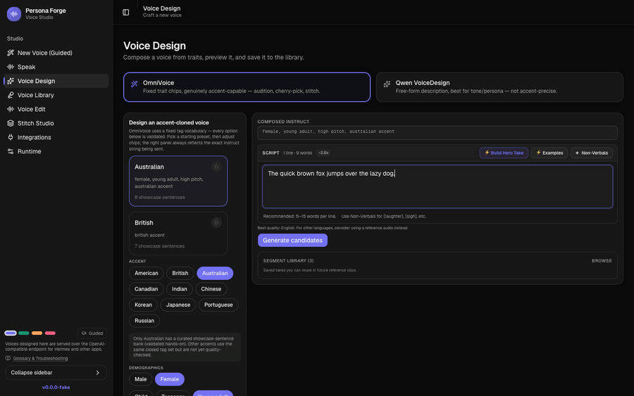

**Voice Design → Stitch Studio** — compose a voice from trait chips, then assemble it into a
reference clip:

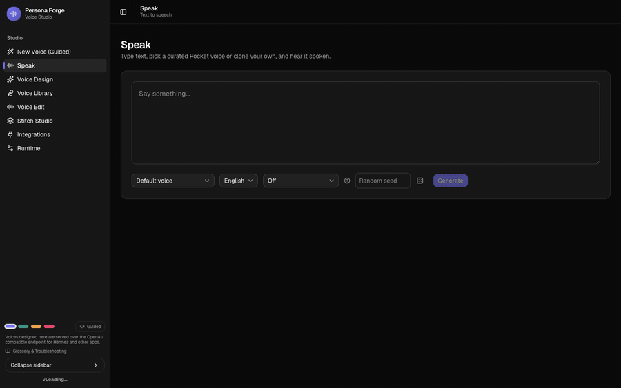

**The signal layer** — a true-scale waveform, a dBFS meter with peak hold, and a live
spectrogram, all drawn from one media clock while the take plays:

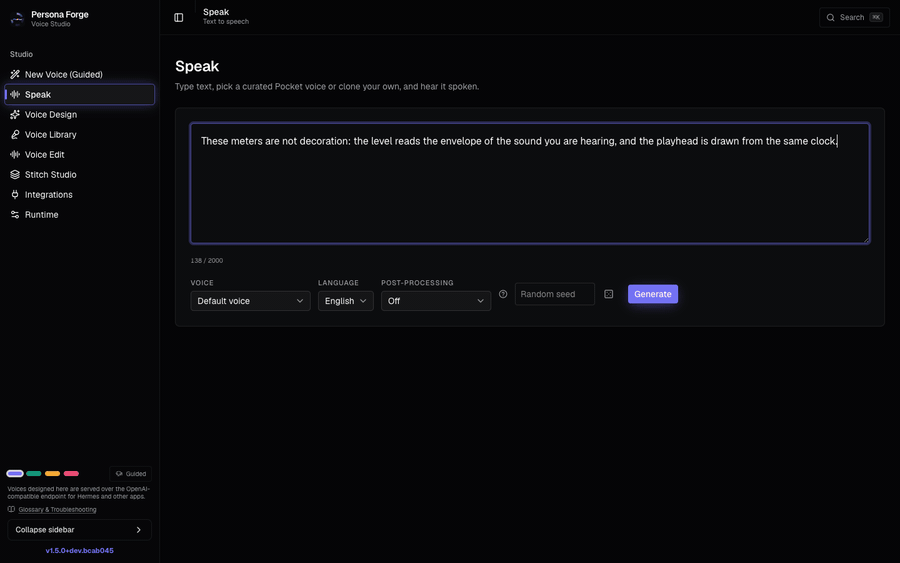

---

## What it does

| | Feature | Description |
|---|---|---|
| 🎙️ | **Voice cloning** | Clone a voice from one reference WAV. No fine-tuning, no training data. |
| 🎨 | **Voice Design** | Compose a voice from trait chips — gender, register, texture, persona — or a free-form description. Preview, then save. |
| 🌏 | **Accent design** | OmniVoice generates candidates per segment across accents. Audition them, cherry-pick the best takes, stitch the winners into a reference voice. |
| ✂️ | **Stitch Studio** | Drag segments onto a timeline. Per-clip trim, fade, gain, and DSP, with live preview. |
| 📚 | **Voice Library** | Prosody fingerprints (LUFS, speech rate, pause ratio, peak dBFS) for every saved voice. Fork, edit, compare variants. |
| 🎵 | **Voice Edit** | A dedicated prosody workspace: preview pacing, save a non-active variant, then explicitly promote it. |
| 🔌 | **OpenAI-compatible API** | `POST /v1/audio/speech` — a drop-in TTS endpoint for any OpenAI SDK client. |
| ⚡ | **CPU-first** | The default pocket-tts backend runs on any CPU. Qwen3-TTS (PyTorch or OpenVINO) is opt-in. |
| 🎛️ | **Live runtime config** | Change backend, idle-unload timer, and DSP knobs from the UI. No restart. |

---

## Screenshots

<table>
<tr>
<td width="50%">

**Speak** — generate from any saved voice

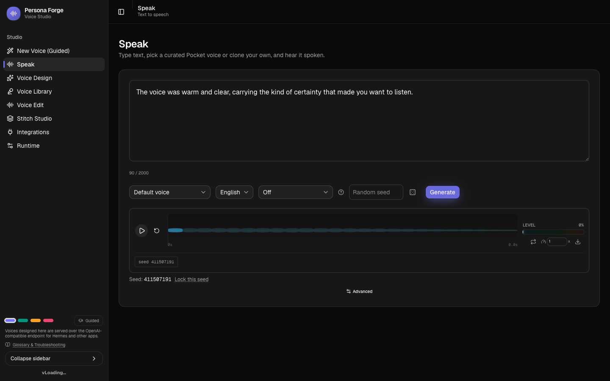

</td>
<td width="50%">

**Voice Design** — compose from trait chips

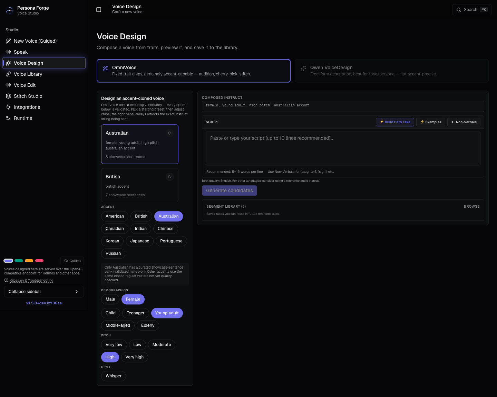

</td>
</tr>
<tr>
<td width="50%">

**Prosody Adjustment** — control pause placement with word-level precision

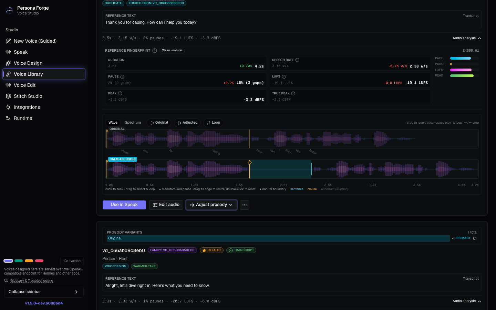

</td>
<td width="50%">

**Stitch Studio** — assemble clips into a new reference voice

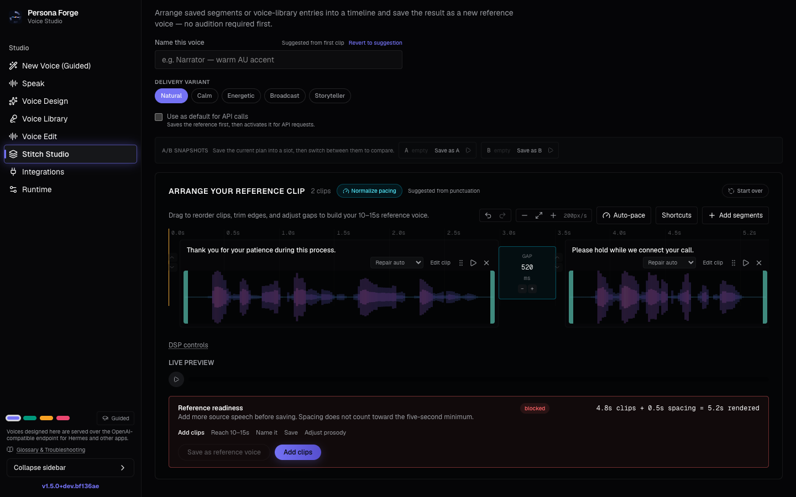

</td>
</tr>
<tr>
<td width="50%">

**Voice Edit** — save and promote prosody variants without leaving the workspace

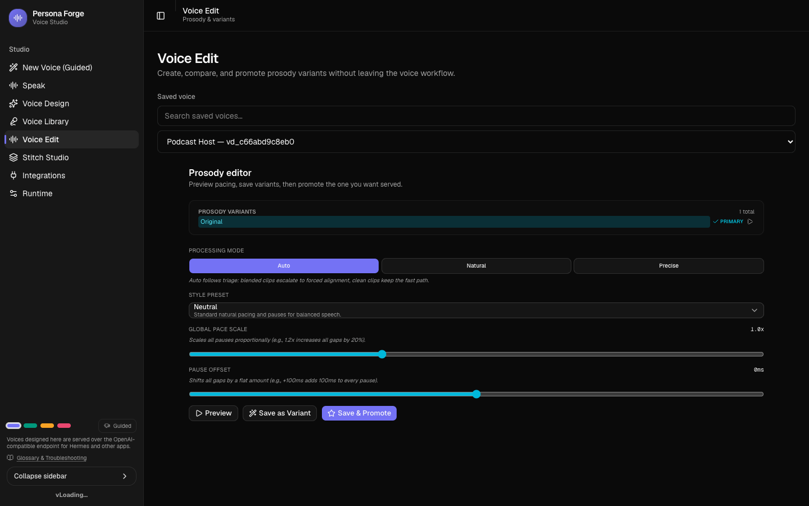

</td>
<td width="50%">

**Stitch readiness** — source duration, spacing, and save guidance stay explicit

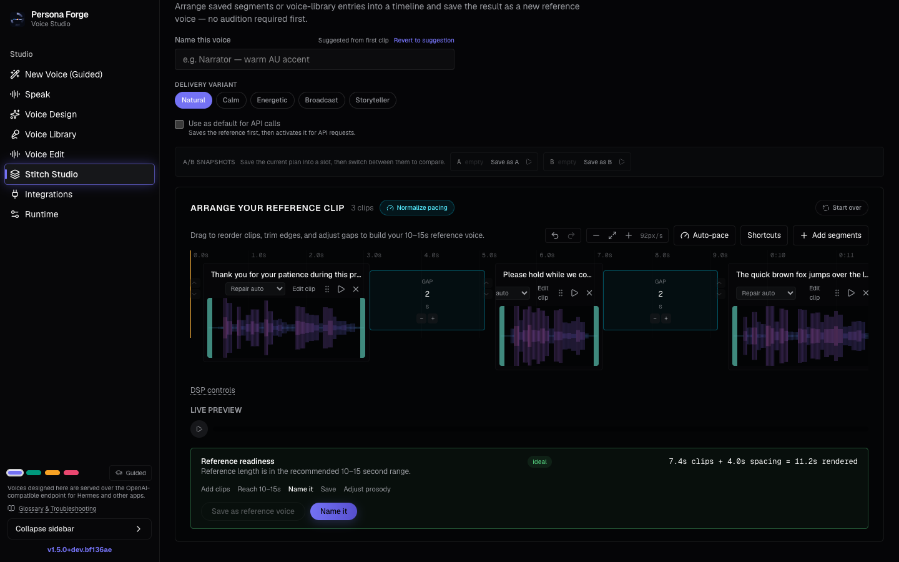

</td>
</tr>
<tr>
<td width="50%">

**Voice Edit prosody A/B** — original and adjusted takes on one ruler, with pause markers you can drag

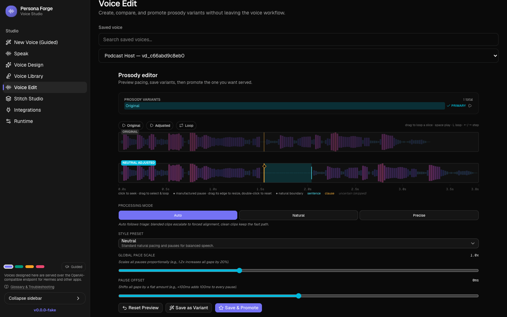

</td>
<td width="50%">

**Accent audition** — compare takes per segment before stitching

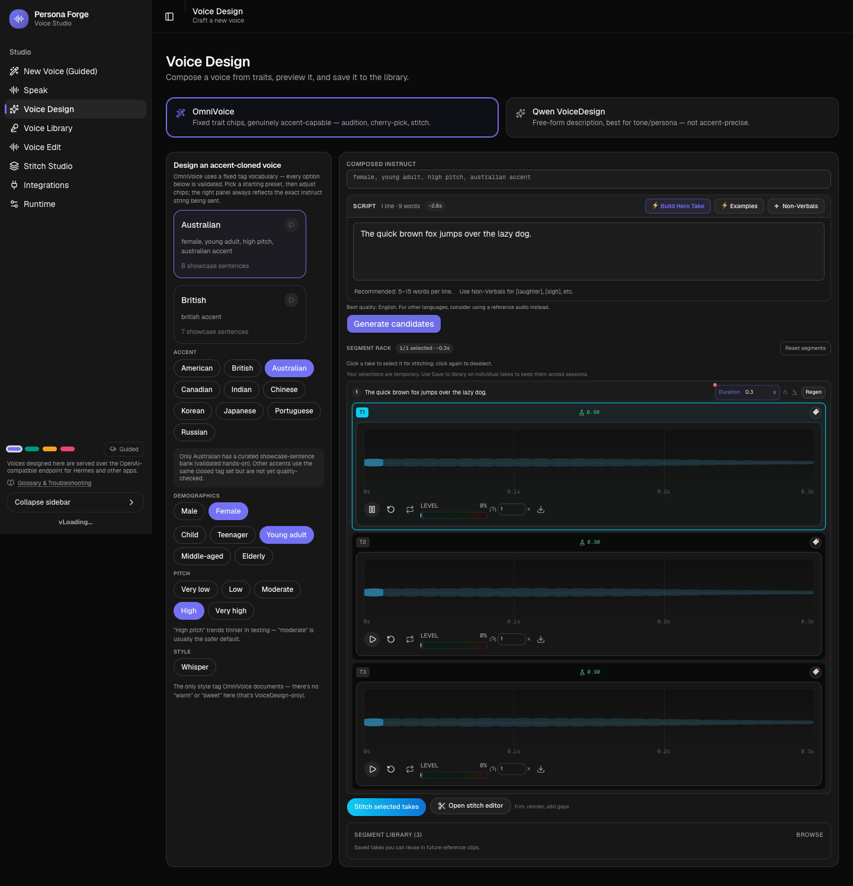

</td>
</tr>
</table>

---

## Install the desktop app

**The recommended install is the desktop app.** Download the installer for your platform from
[GitHub Releases](https://github.com/nmorgowicz-org/persona-forge/releases):

| Platform | Download | Status |
|---|---|---|
| macOS Apple Silicon | `PersonaForge-macos-aarch64.dmg` | Signed and notarized |
| Windows x86-64 | `PersonaForge-windows-x86_64-setup.exe` | Unsigned preview; read the Windows warning below |
| Linux x86-64 | `PersonaForge-linux-x86_64.AppImage` | **Preview**; GNOME users may need the AppIndicator extension for the tray icon |

The desktop app guides first-time setup and includes its own server. It detects your GPU
automatically and provisions the matching PyTorch accelerator when available — NVIDIA CUDA 12/13,
Intel Arc iGPU (XPU), and AMD ROCm on Linux — falling back to CPU inference with a notice if
anything fails. See the [desktop app guide](docs/architecture/DESKTOP_APP.md) for requirements,
Settings, update behavior, GPU acceleration, and troubleshooting.

> **Windows: the installer is not code-signed.** Windows SmartScreen will show "Windows
> protected your PC". Click **More info → Run anyway**. This allows only this installer; you
> do not need to turn SmartScreen off. The same prompt can appear after an update.
>
> If **Smart App Control** is on, Windows blocks unsigned apps with no "Run anyway" option.
> To install, turn it off in Windows Security → App & browser control → Smart App Control
> settings → Off. On some Windows versions it cannot be turned back on without resetting
> Windows, so decide before you switch it off.

### Headless installs

Use the container on any supported host when you want a headless service, including GPU
deployments. On Linux x86-64, the CLI launcher archive is also available for headless native
installs. The macOS and Windows CLI archives are not distributed; for headless use on those
platforms, install the release wheel with `uv tool install persona-forge` and start it with
`uvx persona-forge serve`. See [RUN_LOCAL.md](docs/RUN_LOCAL.md) for the wheel and Linux archive
instructions, or [HOW_TO_RUN.md](docs/HOW_TO_RUN.md) for the container path.

## Run in a container (headless)

The published container is the recommended headless path. Images are published to
[GHCR](https://github.com/nmorgowicz-org/persona-forge/pkgs/container/persona-forge) on every
release — this pulls a prebuilt image rather than building from source.

```bash
git clone https://github.com/nmorgowicz-org/persona-forge.git
cd persona-forge
cp .env.example .env          # optional: set HF_TOKEN, REF_AUDIO_PATH
echo 'PERSONA_FORGE_IMAGE=ghcr.io/nmorgowicz-org/persona-forge:latest' >> .env
docker compose up -d persona-forge
open http://localhost:8318
```

The service is ready when `GET /health` reports `"model_loaded": true` — roughly 30–60 seconds on
first boot with the default pocket-tts backend.

Leave `PERSONA_FORGE_IMAGE` unset only if you're changing the Dockerfile/source and want
`docker compose up --build` to build a local image instead. See [Container image](#container-image)
below for pinned version/digest tags.

> **No Compose, or don't want to clone the repo?** Run the published image directly:
>
> ```bash
> docker run -d --name persona-forge -p 8318:8318 \
>   -v "$(pwd)/data/model:/root/.cache/huggingface/hub" \
>   -v "$(pwd)/data/voices:/voices" \
>   ghcr.io/nmorgowicz-org/persona-forge:latest
> ```
>
> Covers the pocket-tts default with a persistent model cache and voice library. See
> [compose.yml](compose.yml) for the full set of optional volumes/env (reference audio, OpenVINO
> IR cache, segment library).

> **Want the Qwen engine with OpenVINO acceleration?** Run the export step first and set
> `TTS_BACKEND=openvino`. See [HOW_TO_RUN.md](docs/HOW_TO_RUN.md).

---

## HTTP API

Docker and the CLI default to port 8318; the desktop app selects and remembers a port in the
8318–8348 range. There is **no authentication by default**.

| Method | Path | Description |
|---|---|---|
| `GET` | `/health` | Health, model status, backend and mount info |
| `POST` | `/v1/audio/speech` | **OpenAI-compatible TTS** |
| `POST` | `/generate` | Native TTS — adds `language`, `seed`, `prosody_repair` |
| `GET` | `/voices` | Saved voices with prosody metrics |
| `POST` | `/voice_design` | Generate a voice from a description |
| `POST` | `/omnivoice/audition` | Accent audition (streaming, multi-segment) |
| `GET`/`POST` | `/runtime/config` | Live runtime configuration |

```bash
curl -s http://localhost:8318/v1/audio/speech \
  -H "Content-Type: application/json" \
  -d '{"input": "Hello world", "voice_id": "vd_000000000001", "response_format": "mp3"}' \
  --output speech.mp3
```

```python
from openai import OpenAI

client = OpenAI(base_url="http://localhost:8318/v1", api_key="unused")
client.audio.speech.create(
    model="tts-1", voice="vd_000000000001", input="Hello world"
).stream_to_file("speech.mp3")
```

Full reference: **[docs/api/HTTP_API_REFERENCE.md](docs/api/HTTP_API_REFERENCE.md)**

---

## Container image

```bash
docker pull ghcr.io/nmorgowicz-org/persona-forge:latest
```

Pin a version — or a digest — for anything you depend on:

```bash
docker pull ghcr.io/nmorgowicz-org/persona-forge:v3.1.0  # x-release-please-version
```

Tags: `latest`, `v<major>.<minor>.<patch>`, `<git-sha>`. Use any of these as
`PERSONA_FORGE_IMAGE` (see [Run in a container](#run-in-a-container-headless)) instead of `latest` for a
reproducible deploy.

**Container vs. native — why both exist.** The desktop app is the recommended install: it
bundles its own Python runtime, provisions the matching PyTorch accelerator automatically, and
updates itself through Sparkle (macOS) or the Tauri updater (Windows/Linux). The container
packages the runtime, source-level patches, and the frontend build into one pinned, reproducible
artifact — backend and frontend — so none of that complexity is visible to the operator, and it
remains the most-tested headless deployment path. For local interactive use, the desktop app is
recommended; for headless services, the container is the recommended path. Headless native installs
use the Linux CLI archive or the release wheel on macOS and Windows; source checkout via `uv`
remains available for development. See [RUN_LOCAL.md](docs/RUN_LOCAL.md) for native paths and
hardware-validation status, and [MIGRATION.md](docs/MIGRATION.md) for moving between container and
native installs.

---

## Documentation

**[📖 Full documentation index](docs/README.md)**

Quick links: [Desktop app](docs/architecture/DESKTOP_APP.md) · [Container setup](docs/HOW_TO_RUN.md) ·
[Headless native setup](docs/RUN_LOCAL.md) · [Migration](docs/MIGRATION.md) ·
[Environment](docs/ENV_REFERENCE.md) · [HTTP API](docs/api/HTTP_API_REFERENCE.md) ·
[Architecture](docs/architecture/SYSTEM_OVERVIEW.md) · [Contributing](docs/dev/LOCAL_SETUP.md)

---

## Security

No authentication and no TLS out of the box. Persona Forge is built to run on a trusted LAN or
behind an authenticated reverse proxy. **Do not expose port 8318 to the internet** without putting
auth in front of it.

Reporting: [SECURITY.md](SECURITY.md)

---

## License

[MIT](LICENSE) — with the exception of OmniVoice model weights, which are CC-BY-NC
(non-commercial). See [OMNIVOICE_REFERENCE.md](docs/architecture/OMNIVOICE_REFERENCE.md).
