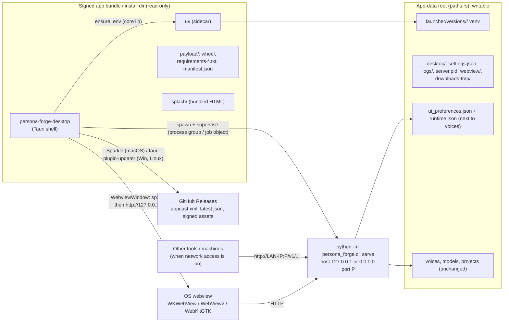
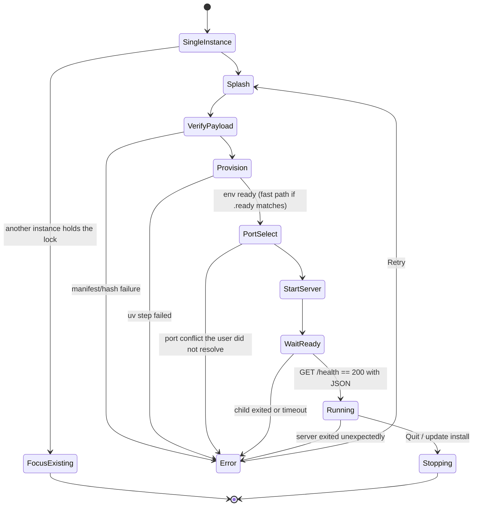

# Persona Forge Desktop — Architecture Contract

**Status:** draft for owner review, 2026-09-25. Binding design for
`20260925-native_app_shell_auto_update.md` (the execution plan) once the owner approves it.
When the two docs conflict, **this doc wins**. The execution plan may not relax a decision here.
To change a decision, amend this doc in a separate commit and get owner sign-off.

**Amendment 2026-09-26 (owner-approved):** D20 (macOS window polish) and D21 (downloads never
block; Downloads folder by default, optional "Ask where to save"). They change §6.4, §6.5, §6.7,
§6.10, §6.13, §13, §14 and §15.

**Baseline:** `1e2f520` (the plan-draft commits on top of `87d6547`, PR #326).

**Supersedes:** the "Options considered", "Update mechanism options" and "Recommendation"
sections of the first draft of the execution plan. §3 below says what changed and why.

---

## 1. Goal

Ship **Persona Forge Desktop**: an installable, signed (macOS), self-updating desktop app for
macOS arm64, Windows x86_64 and Linux x86_64. It wraps the existing Flask server and React SPA
without rewriting them.

"First-class" here means these things a user can see. Each one has a gate in the execution plan:

1. **Install like a normal app.** macOS: a notarized, stapled `.dmg` with a drag-to-Applications
   layout. Windows: a per-user NSIS installer that needs no admin rights. Linux: a
   self-updating `.AppImage`.
2. **Launch like a normal app.** No terminal, no browser tab. The app has a Dock or taskbar icon,
   a native main window, native menus (including a working Edit menu for Cmd/Ctrl+C/V/Z/A),
   and remembers window size and position.
3. **First run is guided.** A native splash window shows progress while the Python environment
   is provisioned (this can take minutes and download gigabytes). It also shows errors, with
   Retry and "Show Logs" actions. Nothing blocks silently.
4. **One instance only.** A second launch focuses the existing window. It never starts a second
   server.
5. **The app owns its server.** Quitting the app stops the server and its whole process tree.
   If the app crashes, Windows kills the server immediately (Job Object); on macOS and Linux
   the leftover server is found and stopped on the next launch (§6.2).
6. **Updates install themselves.** The app checks for updates, downloads them, verifies a
   cryptographic signature, installs the new version and relaunches on the user's consent. The
   Python environment then re-provisions itself for the new version.
7. **The web UI behaves natively.** Audio downloads open a Save dialog. External links open in
   the system browser. The window cannot be navigated away to arbitrary sites.
8. **Optional tray / menu-bar presence.** The server can keep running with the window closed.
9. **Diagnosable.** Logs are one menu click away. The existing CLI `doctor` still works.
10. **Usable as a server for your other tools.** A Settings window sets the port and an "Allow
    other devices on my network" switch, and shows the address to paste into other tools
    (including the OpenAI-compatible `/v1` base URL). "Copy Server Address" is in the menus.
11. **Preferences follow the install, not the browser.** Theme, layout and similar UI
    preferences are saved by the server next to `runtime.json`, so they survive port changes and
    are the same in the app window and in any browser pointed at the server.

The existing CLI bootstrap archive (`persona-forge-bootstrap-*`) keeps shipping, unchanged in
behavior, for headless and server users.

## 2. Decisions

| ID | Decision | Rationale (evidence in §15) | Rejected |
| --- | --- | --- | --- |
| D1 | Shell framework is **Tauri v2** (current stable line; pin exact versions in `Cargo.lock`). | It is built on the same crates as the org's `wry`/`tray-icon` precedent (wry, tao, muda, tray-icon). Its own benchmarks show about 2.5 MB more binary and no measurable extra RAM. It provides single-instance, window-state, menus, dialogs, notifications, updater and a bundler. With raw wry we would hand-build about 8–10 of these. | Raw wry + Velopack, raw wry + cargo-packager (owner, 2026-09-25). Electron (owner, earlier). |
| D2 | The main UI is a **native main window** that loads the local server at `http://127.0.0.1:<port>/`. There is an **optional tray / menu-bar icon**, on by default. | Stitch Studio and the libraries are full-size UIs, so a popover does not fit. | Tray popover (the foundry shape). Main window with no tray. |
| D3 | **macOS updates use Sparkle 2** via `tauri-plugin-sparkle-updater`. **Windows and Linux use `tauri-plugin-updater`.** | Tauri's macOS install runs in-process and is not atomic (open issue #3505, which can delete the app; fix PR #3578 is unmerged). socadb-desktop moved macOS to Sparkle on 2026-09-24. Sparkle swaps the bundle atomically from an out-of-process helper and uses EdDSA signatures. | Tauri updater on every OS. Velopack (sha256 only, no signature). The foundry's DIY binary swap. |
| D4 | **The update unit is the whole signed app bundle or installer.** We never swap a single binary. | The launcher checks that manifest + wheel + requirements + uv sit together as one set. On macOS, replacing only the inner Mach-O breaks the bundle's code seal and the stapled ticket (Apple TN3126). | The llama-monitor-style atomic rename of one binary. |
| D5 | **The Python venv stays outside the bundle**, under the existing `paths.rs` app-data root. It is versioned per `manifest.version`, as `bootstrap.rs` already does. | A signed bundle must never be written to. The existing staging → promote → `current.txt` rollback logic is reused as-is. | A venv inside the bundle. A frozen Python (PyInstaller-style). |
| D6 | **macOS build topology:** compile, bundle and make the DMG on `self-hosted-macos` **without any secrets**. Sign, notarize and staple the `.app`, and later the DMG, with **rcodesign** on the **ephemeral** Linux runner `arc-persona-forge-desktop`, using the existing PEM + API-key secrets (`tauri build --no-sign`, then rcodesign). Verification (`codesign`, `spctl`, `stapler validate`) runs back on `self-hosted-macos`, again without secrets. | Tauri's `.app`/`.dmg` bundling only compiles on a macOS host (`cfg(target_os="macos")` in tauri-bundler), and the DMG step uses `hdiutil`. rcodesign runs on Linux, which today's release pipeline already relies on. See D19 for why secrets stay off the persistent runners. | osxcross + a hand-assembled `.app`. Tauri's built-in signing (needs `.p12` + keychain). Signing on `self-hosted-macos`. |
| D7 | **Windows build topology:** native build on `self-hosted-windows` **without any secrets**, target `x86_64-pc-windows-msvc`, **NSIS per-user (`currentUser`)** installer, WebView2 `embedBootstrapper`. The updater `.sig` is produced afterwards by `tauri signer sign` on the ephemeral Linux runner (D19). **Unsigned "preview" channel**: the owner will not buy a code-signing certificate (2026-09-25). | Tauri calls cargo-xwin NSIS builds from Linux a "last resort". MSVC is Tauri's supported Windows target. Per-user install avoids UAC. | Authenticode / Artifact Signing. MSI. The windows-gnu target. |
| D8 | **Linux: x86_64 only, `.AppImage` only** (owner, 2026-09-25). Linux is a **CI-verified preview**: the owner has no Linux desktop, so every Linux gate is automated (build, headless smoke, WebDriver GUI check under Xvfb, automated update and bad-signature tests). Build on a **new glibc-2.35 (Ubuntu 22.04) ARC runner image** (§11). | The oldest glibc we build against sets the oldest distro we support; the shared runner image is Ubuntu 26.04. No human can test a `.deb`, and the Tauri updater's `.deb` path (pkexec) is the least proven, so shipping it would be an untested second install and update path. | aarch64 Linux. `.deb`, Flatpak, Snap, apt repo. |
| D9 | **Keep one Rust codebase.** `launcher/` becomes lib + bin (`persona_forge_launcher` lib). The new `desktop/` Tauri crate depends on it by path. | The venv/manifest/path logic must not fork. `paths.rs` is already kept in lockstep with `paths.py`. | Copying the bootstrap code into `desktop/`. |
| D10 | **No Tauri IPC for the remote origin.** Only bundled local pages get IPC: the splash (window `main` while it shows the splash) and the Settings window (window `settings`). The SPA served from `127.0.0.1` gets no capabilities. | Tauri docs: remote-origin IPC needs `remote.urls` capabilities and cannot tell iframes apart on Linux. Keeping the SPA IPC-free keeps it identical in the browser and in the desktop app. | Exposing updater or other commands to the SPA. |
| D11 | **Stable, user-settable port.** Default "Automatic": 8318, or the first free port in 8319–8348, picked once and persisted. The user can set a fixed port in Settings. The app window always connects to `http://127.0.0.1:<port>/`, whatever the bind address (D18). | Tools on other machines need an address that does not change between launches. Browser storage is filed per address+port; D17 moves the preferences that matter out of it, so a port change no longer resets them. | Random port each launch. Custom-protocol proxying. |
| D12 | **Signed update feeds on GitHub Releases**, fetched from `releases/latest/download/`. Sparkle: `appcast.xml`, EdDSA-signed DMG. Tauri: `latest.json` with minisign `.sig`. Two **new** secret keys are allowed (§12). | Updates must prove authenticity, not just integrity. A checksum hosted next to the binary proves nothing if that channel is compromised. | Checksum-only verification (the foundry's approach, or Velopack's). |
| D13 | The **desktop shell owns the update UX.** The SPA's existing `UpdateAvailableBanner` hides itself when `/health` reports `shell == "desktop"`. | This avoids two competing update prompts. The banner's "open release page" flow stays correct for CLI and Docker users. | Driving updates through the SPA with IPC (conflicts with D10). |
| D14 | **Env retention:** after a new version provisions successfully, keep the `current` env and the most recent previous one. Delete older envs, **except any env a live process is running from** (a CLI server started from an older archive, for example); it is left for the next prune. **Never delete a child whose version compares semver-greater than `keep_current`**, even when idle (D14: a stale older CLI archive and the desktop app share one `versions/` dir; an old archive's prune must not delete a newer desktop env). Unparseable names are treated as older. Detection uses the `sysinfo` crate (process executable paths under `versions/<v>/`). This applies to both the CLI and the desktop app. | Auto-updates multiply versions, and each env holds GB-scale torch wheels. One previous env keeps the documented rollback property. Deleting a venv under a running server would break it (and fail halfway on Windows). | Unbounded growth (today's behavior). |
| D15 | Minimum OS: **macOS 14.0** (the torch wheel tags force it: `MACOSX_DEPLOYMENT_TARGET=14.0` in `package_launcher_archive.py`), **tested on macOS 26**; **Windows 11** (Windows 10 is out of Microsoft support since 2025-10-14; it may work but is untested); **glibc 2.35+** (Ubuntu 22.04+, Debian 12+, including the owner's Debian 13). | Strictest existing constraint, the runner baseline (D8), and the machines the owner can test on (execution plan OA-7). | Declaring Windows 10 supported without a test machine. |
| D16 | Product identity (owner confirmed 2026-09-25): product name `Persona Forge`, bundle identifier `org.nmorgowicz.personaforge`, binary `persona-forge-desktop`. App icon from the owner-selected **Signal Crucible** concept pack (`assets/brand/concepts/persona-forge/hero-v2/finalists/signal-crucible/svg/`): `favicon.svg` (rounded-square app icon) is the source for the app icon, and `mark-small.svg` is the source for a single-color tray / menu-bar icon (§6.4). | The identifier is permanent once released: it keys the WebKit data store, Sparkle defaults and the Windows uninstall entry. | — |
| D17 | **UI preferences are stored by the server**, in `ui_preferences.json` in `paths.runtime_data_dir()`, the same directory as `runtime.json` (the same pattern as `runtime_store.py`). This applies in every deployment: desktop, CLI and Docker. The SPA keeps a `localStorage` copy only for instant first paint (§6.11). | Preferences survive port changes (D11) and are shared by the app window and every browser that uses the same server. `runtime_data_dir()` defaults to the voice library directory, so on a native macOS install the file is `~/.config/persona-forge/voices/ui_preferences.json`; in Docker, `runtime_data_dir()` resolves through the `VOICE_LIBRARY_DIR` the compose file sets today (the resolver's `DATA_DIR` override takes precedence when set). | Keeping them in browser storage. Having the desktop shell store them (it cannot see the SPA's state without IPC, D10). |
| D18 | **Network access is a user setting, off by default.** Off = the server binds `127.0.0.1`. On = it binds `0.0.0.0`, and Settings shows every LAN address to use. No authentication and no Host-header allowlist are added in this initiative (owner, 2026-09-25: API keys and related hardening come later). | The owner wants other machines' tools to reach the TTS server, matching how the container is used. Off by default because the server has no auth, and because the OS firewall prompt (§10) should appear only when the user asks for network access. A Host allowlist (IP literals, `localhost`, the machine's own names) would **not** break LAN-IP access and would block DNS rebinding; it is deferred only because Docker and reverse-proxy users reach the server by custom hostnames and need a configuration story (§10 follow-up). | On by default. Waiting for auth before shipping network access. |
| D19 | **Signing secrets are used only on ephemeral runners.** `self-hosted-macos` and `self-hosted-windows` are persistent machines that also run same-repo PR lanes (Renovate branches included); a malicious dependency's build script could leave something behind that reads keys during a later release. So no job on them ever receives `MACOS_*`, `APPLE_*`, `SPARKLE_ED_PRIVATE_KEY` or `TAURI_SIGNING_*`. All signing happens on fresh ARC pods (`arc-persona-forge-desktop` for code signing and updater signatures, `arc-general` for feed generation). Build outputs move between jobs as workflow artifacts. | Keeps the release keys off machines that run untrusted-ish code, at the cost of a few extra artifact hops. | Writing secrets to `$RUNNER_TEMP` on the persistent runners and deleting them afterwards (does not help if the machine is already compromised). |
| D20 | **macOS window polish, no SPA IPC.** On macOS the main window uses `titleBarStyle` **`Transparent`** with a hidden title, a transparent window, and the native **`sidebar`** vibrancy material (`windowEffects`, state `followsWindowActiveState`). This needs `app.macOSPrivateApi: true` (Tauri's `macos-private-api` feature). The shell tells the SPA it is inside the desktop window with an **initialization script**, not IPC (§6.10). Only then does the SPA apply its desktop-only CSS: transparent page and sidebar backgrounds so the material shows through, opaque content area. Windows and Linux windows are unchanged. | Owner, 2026-09-26: "native feel" on macOS with one UI for all three platforms. `Transparent` (unlike `Overlay`) keeps the native title strip, so dragging and double-click-to-zoom stay native; `Overlay` would need HTML drag regions, which call `plugin:window\|start_dragging` over IPC (Tauri `drag.js`) and so break D10. Translucency comes only from the native material, because WebKit does not support `prefers-reduced-transparency` (the SPA cannot see that setting). AppKit's material is expected to turn opaque when Reduce Transparency is on; Gate 3 checks it on the Mac. | A separate native (SwiftUI/AppKit) UI (owner: no second UI to maintain). `titleBarStyle: Overlay` + drag regions (needs a D10 exception). Private Liquid Glass (`NSGlassEffectView`, §13). |
| D21 | **Downloads never block, and go to the Downloads folder by default.** `on_download` `Requested` returns immediately with a destination in the user's Downloads folder (a unique name if taken). A Settings switch **"Ask where to save each file"** (off by default) instead downloads to a temp file and, on `Finished`, opens the **non-blocking** Save dialog and moves the file there (Cancel deletes it). | Phase 1 (1C, 2026-09-26): showing the Save dialog from `on_download` deadlocks the app on every OS. `blocking_save_file()` queues the dialog onto the main thread and waits for it, but `on_download` already runs on the main thread (the CI app's main thread sat in `futex_wait` with no event loop). Downloads-folder-by-default matches Safari and Chrome. The switch keeps a Save-As flow for users who want one (owner, 2026-09-26). | A Save dialog inside `on_download` (deadlock). Always Save-As after download (a dialog on every download). |

## 3. Review of the first draft: what changed and why

| Draft claim or choice | Finding | Change |
| --- | --- | --- |
| Option C (hand-rolled wry + tray-icon) is "proven in production in this org". | The foundry ships a **tray popover**, is unsigned, and uses `winit 0.31.0-beta` (a pre-release) with `WebView2Loader.dll` copied next to the exe on the GNU target. None of that proves a signed, main-window, auto-updating app. | D1: Tauri v2 (same underlying crates). |
| Tauri is "materially larger". | Tauri's own benchmarks show about 2.9 MB for the Tauri binary vs 0.5 MB for raw wry, and 396 vs 400 MB peak RAM on Linux. The uv binary we already ship is about 17–20 MB. | Rationale removed. |
| The DIY update swaps `persona-forge-launcher` in place (rename on Unix, `.bat` on Windows). | This is **wrong for our bundle**: `main.rs` resolves `manifest.json`/wheel/requirements/uv next to the exe, so a new binary with an old payload never updates the app. In a `.app` it also breaks the code seal. The `self-replace` docs call `.bat` helpers "very racy". | D4: whole-bundle updates only. |
| "`sparkle-updater` wraps Sparkle + WinSparkle behind one API." | **False.** `sparkle-updater` 0.1.0 is macOS-only. No WinSparkle Rust crate exists. | D3 uses `tauri-plugin-sparkle-updater` (macOS) plus the Tauri updater elsewhere. |
| "All builds stay on `arc-llama-monitor`." | Tauri `.app`/`.dmg` bundling needs a macOS host. The current runner image is built on Ubuntu 26.04, so an AppImage built there would refuse to run on 22.04/24.04 desktops. | D6, D7, D8, §11. |
| "No new secrets." | Signed update feeds need their own signing keys (minisign, EdDSA). An Apple Developer ID cannot sign a Tauri or Sparkle feed. | D12, §12. |
| Update pill in the SPA plus `POST /api/self-update`. | The SPA **already** has `frontend/src/lib/updateCheck.ts` + `UpdateAvailableBanner.tsx` (GitHub API, 24 h cache, dismissal). The draft ignored it. A Flask endpoint that replaces its own host app inverts ownership. | D13. |
| Phase 3 UI left open ("tray popover vs window"). | Owner decided on 2026-09-25. | D2. |
| `.app.zip` for distribution. | Apple cannot staple a zip. A zip also invites App Translocation, and Sparkle refuses to update a translocated app. | DMG (D6), plus a move-to-Applications check (§6.9). |
| `release-launcher.yml` runs on `arc-llama-monitor`. | Read-only inspection of the cluster (2026-09-25, `helm get values` over `ssh nick@arc-runner`): `arc-llama-monitor` is deployed **org-scoped**, so it serves both projects; its values file in `../llama-monitor-runner/deploy/` is stale (still says `local-llm-foundry`). `arc-persona-forge-release` is still deployed, repo-scoped, and unused. | Keep `arc-llama-monitor` for the CLI launcher and fix its stale values file. Add a dedicated desktop Linux runner. Uninstall the abandoned set (§11). |
| Nothing about first-run UX, process supervision, port/origin, downloads, external links, or the Edit menu. | These are the difference between "a webview" and "an app". | §6. |
| No Rust CI lane. | No workflow runs `cargo test` for `launcher/` today. | The execution plan adds `ci-desktop.yml`. |

## 4. System overview



## 5. Repository layout (target)

```text
launcher/                       Cargo package persona-forge-launcher: lib + bin (D9)
  src/lib.rs                    NEW: pub mod bootstrap, health, manifest, paths, retention, supervisor
  src/main.rs                   CLI bin; behavior unchanged except D14 retention
  src/bootstrap.rs              + Progress trait, ensure_env_with_progress
  src/manifest.rs               + verify_payload (wheel + requirements only)
  src/health.rs                 NEW: std-only /health probe and port classification
  src/supervisor.rs             NEW: spawn/stop server process tree, readiness probe, pidfile
  src/retention.rs              NEW: D14 env pruning (skips envs a live process runs from)
desktop/                        NEW Cargo package persona-forge-desktop (Tauri v2)
  Cargo.toml, Cargo.lock, build.rs
  tauri.conf.json               base config (Windows/Linux updater, bundle, resources)
  tauri.macos.conf.json         macOS overrides (no Tauri updater artifacts, Sparkle, Info.plist)
  Info.plist                    merged keys (LSMinimumSystemVersion, Sparkle keys)
  entitlements.plist            hardened-runtime entitlements (minimal)
  capabilities/splash.json      IPC permissions for the splash page only
  capabilities/settings.json    IPC permissions for the Settings window only
  icons/                        generated by `tauri icon` from icons/source/app-icon.svg
  icons/source/                 app-icon.svg (macOS icon grid) and tray-template.svg, derived from D16 assets
  splash/index.html, splash.js, splash.css   bundled first-run/progress/error UI (no npm build)
  splash/settings.html, settings.js         bundled Settings window, loaded as WebviewUrl::App("settings.html")
  src/main.rs                   entry: args::parse, then --smoke-test, --ci-update (feature) or tauri::Builder
  src/args.rs                   strict argument parsing; unknown `--` flags exit 2 (§6.8)
  src/bundle_paths.rs           payload dir + uv path without an initialized Tauri app (§6.8)
  src/app.rs                    startup state machine, window/menu/tray wiring
  src/settings.rs               desktop/settings.json (port, network access, tray, ask-where-to-save)
  src/netinfo.rs                LAN addresses shown in Settings and "Copy Server Address"
  src/port.rs                   D11 port selection (pure, unit-tested)
  src/nav.rs                    navigation classification (pure, unit-tested)
  src/downloads.rs              non-blocking download handling: Downloads folder or ask-where-to-save (D21)
  src/translocation.rs          macOS App Translocation guard (§6.9)
  src/menu.rs, src/tray.rs, src/logs.rs, src/updates.rs, src/smoke.rs
  src/ci_hooks.rs               test-only update driver, compiled only with `--features ci-hooks` (§6.12)
  payload/                      build-time staged (gitignored): wheel, requirements, manifest.json
  binaries/                     build-time staged (gitignored): uv-<target-triple>[.exe]
scripts/desktop_preflight.sh          NEW: toolchain preflight per runner OS
scripts/stage_desktop_payload.py      NEW: stage payload/ and binaries/ for one target
scripts/build_macos_dmg.sh            NEW: hdiutil DMG from a signed .app
scripts/sign_macos.sh                 NEW: rcodesign sign/notarize/staple of an .app or .dmg (runs on Linux)
scripts/set_feed_base.py              NEW: rewrites SUFeedURL in Info.plist for test builds
scripts/generate_update_feeds.py      NEW: appcast.xml + latest.json from release assets
scripts/smoke_desktop.sh, smoke_desktop.ps1  NEW: installed-artifact smoke per OS
scripts/desktop_gui_check.py          NEW: Linux WebDriver GUI check
.github/workflows/desktop-preflight.yml   NEW (workflow_dispatch): runner toolchain preflight
.github/workflows/desktop-build.yml       NEW reusable (workflow_call + workflow_dispatch): build, sign, smoke
.github/workflows/desktop-update-e2e.yml  NEW (workflow_dispatch): test feeds + automated update tests
.github/workflows/desktop-spike.yml       TEMPORARY (Phase 1 only; deleted in Phase 1 cleanup)
.github/workflows/ci-desktop.yml          NEW (PR lane: cargo test/clippy for launcher + desktop; no secrets)
.github/workflows/release-launcher.yml    MODIFIED: Phase 2 adds `dry_run`; Phase 7 calls desktop-build.yml
```

`src/persona_forge` changes: `cli.py` `serve` becomes supervisable (§6.2), one `/health` field
(§6.10), one env var, and the UI-preferences store plus its two endpoints (§6.11). `frontend/`
changes: `UpdateAvailableBanner` hides itself (D13), preferences go through the new store
(§6.11), and the desktop marker plus macOS-only CSS (D20, §6.10) under
`html[data-desktop='macos']`, which leaves every other environment unchanged.

**Workflow bootstrap rule.** GitHub only dispatches a `workflow_dispatch` workflow whose file
exists on the default branch. Every new dispatchable workflow above therefore lands on `main`
first as a **stub** (same file name, same inputs, one job that prints "stub" and exits 1) in a
tiny PR (execution plan Phase 0). After that, `gh workflow run <file> --ref <branch>` runs the
branch's real version.

## 6. Desktop shell contract

### 6.1 Startup state machine



- The splash is a bundled page in the main window. On `Running`, the main window navigates to
  `http://127.0.0.1:<port>/`. The SPA already renders the model-loading state from `/health`
  (it always returns 200, see `app.py` `health()`), so the shell does not wait for the model.
- `WaitReady` succeeds when the child is still alive **and** `GET /health` returns 200 JSON; it
  fails if the child exits or 180 s pass after spawn. Model downloads happen after that, inside
  the SPA's existing loading banner.
- The splash receives `bootstrap://progress` events: `{step, line?}`. `step` is one of
  `verify | venv | sync | install | start | wait`. Only the last 200 output lines are kept in
  memory. The full output goes to `server.log` / `bootstrap.log`.
- Error screen: a one-line cause, the last 30 log lines, and buttons **Retry**, **Show Logs**,
  **Quit**.

### 6.2 Server supervision (the `supervisor` module in the core lib)

- The command is `<venv python> -m persona_forge.cli serve --host <H> --port <P>`, where `H` is
  `127.0.0.1` or `0.0.0.0` from the network-access setting (D18). The env adds
  `PERSONA_FORGE_SHELL=desktop` and `PERSONA_FORGE_PORT=<P>`. No other env changes.
- **`cli.py` `serve` must change for this to work (Phase 2, found in review 2026-09-25):**
  today `cmd_serve` ends with `os.execvp("gunicorn" | "waitress-serve", ...)`, a PATH lookup.
  Nothing puts the venv's `bin/`/`Scripts\` on PATH when the launcher runs `<venv python> -m
  persona_forge.cli`, so `serve` from the CLI archive most likely fails today (only `doctor` is
  smoke-tested). On Windows, `os.exec*` also starts a *new* process and exits the caller, so a
  supervisor would see its child exit at once. New behavior, same argv otherwise:
  - POSIX: `os.execv(sys.executable, [sys.executable, "-m", "gunicorn", <same args>])`. The
    PID and process group are kept, and no PATH lookup happens.
  - Windows: import the WSGI target and call `waitress.serve(app, host=H, port=P, threads=4)`
    in-process, so `python.exe` stays the long-lived server process.
- Unix: spawn in a **new process group** (`process_group(0)`). Stop: send `SIGTERM` to the group,
  wait up to 10 s, then send `SIGKILL` to the group. Gunicorn's master and worker are both in the
  group.
- Windows: assign the child to a **Job Object** with `JOB_OBJECT_LIMIT_KILL_ON_JOB_CLOSE`, and
  spawn with `CREATE_NO_WINDOW` so no console flashes. The job handle lives for the life of the
  shell, so if the shell dies the OS kills the tree. Stop: there is no graceful signal for a
  windowless child, so call `TerminateJobObject` immediately; every state file the server writes
  is written atomically.
- The shell also runs `Stopping` on `SIGTERM`, `SIGINT` and `SIGHUP` (Unix) and on
  `RunEvent::ExitRequested`, not only on menu Quit.
- Orphan recovery (Unix crash case): write `desktop/server.pid` (`pid`, `pgid`, `port`,
  `started_at`). On startup, if the pidfile names a live process whose command line contains
  `persona_forge.app:app` (the WSGI target in both gunicorn and waitress argv), SIGTERM/SIGKILL
  its group before choosing a port. Otherwise delete the stale pidfile.
- Leak checks in tests and smoke scripts match `persona_forge.app:app`, never
  `persona_forge.cli` (which is gone from the command line after the exec).
- The child's stdout and stderr go to `desktop/logs/server.log` (rotated at startup: keep `.1`
  and `.2`, capped at 10 MB each).
- Use the `process-wrap` crate (process-group and job-object wrappers) instead of hand-written FFI,
  unless Phase 2 shows a blocker.

### 6.3 Port selection (D11)

Settings hold `port_mode` (`"auto"` or `"fixed"`) and `port`. A pure function
`select_port(mode, persisted: Option<u16>, probe: impl Fn(u16) -> PortState) -> PortDecision`,
where `PortState = Free | PersonaForge | Other`. The probe is:

- `Free` if `TcpListener::bind((H, port))` succeeds (then drop it at once), where `H` is the bind
  address the server will use. This also catches listeners bound only to a LAN IP.
- Otherwise `GET http://127.0.0.1:<port>/health` (2 s timeout). `PersonaForge` if the body is a
  JSON object with a string `status` and a `service_started` key; both the normal and the
  startup-failed branches of `model.health_state()` return these. Anything else is `Other`.

1. If a port is persisted and `Free`, use it.
2. If a port is persisted and it is `PersonaForge` (and it is not our orphan, which was already
   stopped in §6.2): show a dialog, "Persona Forge is already running outside the app (for
   example `persona-forge serve` or a container) on port N. Stop it and Retry, or choose another
   port in Settings." Do not attach to it: it may be a different version using the same state
   dir.
3. If a port is persisted and it is `Other`:
   - `auto` mode: take the next free port (step 4), persist it, and show a one-time
     notification: "Port N was busy; Persona Forge is now on port M." The notification says
     tools pointed at the old port need updating.
   - `fixed` mode: never move a port the user chose, because other tools depend on it. Show
     "Port N is in use by another program" with **Open Settings**, **Retry** and **Quit**.
4. With no persisted port (first run, `auto`), scan `[8318, 8319..=8348]` in order. If any
   scanned port is `PersonaForge`, return `ExternalPersonaForge` for it (step 2's dialog): an
   existing CLI user must not get a second server on the same state dir. Otherwise take the first
   `Free` port, persist it, and use it. If none are free, show an error with **Open Settings**.

### 6.4 Windows, menus, tray

- One main window, label `main`. It starts at 1280×832, with a minimum of 960×640. Use
  `tauri-plugin-window-state` for size, position and maximized state.
- **macOS window appearance (D20).** The `main` window builder (macOS only) sets
  `title_bar_style(TitleBarStyle::Transparent)`, `hidden_title(true)`, `transparent(true)` and
  `effects(WindowEffectsConfig { effects: [WindowEffect::Sidebar], state:
  FollowsWindowActiveState })`. `tauri.conf.json` sets `app.macOSPrivateApi: true`, and the
  `tauri` crate enables the matching `macos-private-api` feature (`tauri-build` rejects a
  mismatch). The title strip shows the traffic lights on the translucent material and stays a
  native drag and double-click-to-zoom area; there are no HTML drag regions. The splash page
  uses a transparent `body` background so the material shows behind it too. The `settings`
  window keeps the default opaque look.
- Notes on the Tauri options (verified in `tauri-utils` 2.9.3 / `tauri-build` 2.6.3):
  `windowEffects` requires a transparent window and is ignored on Linux; transparent windows on
  macOS require `macOSPrivateApi`, which Tauri documents as ruling out the Mac App Store
  (already a non-goal, §13). Developer ID notarization is expected to accept it; Phase 5's
  notarized build is the proof (stop and report if Apple rejects it). `titleBarStyle` parses
  case-insensitively and falls back to `Visible` on any unknown value **without an error**, so
  it is set only on the Rust builder (the `TitleBarStyle` enum, where a typo does not compile),
  never as a string in `tauri.conf.json`.
- Menus (built with the Tauri menu API; macOS names in parentheses where they differ):
  - **App menu (macOS):** About, Check for Updates…, Settings… (Cmd+,), Hide, Quit.
  - **File:** Open in Browser, Copy Server Address, Show Logs, and on Windows/Linux also
    Settings… (Ctrl+,), Check for Updates…, Quit.
  - **Edit:** the predefined Undo, Redo, Cut, Copy, Paste, Select All. This is required for
    clipboard shortcuts in WKWebView.
  - **View:** Reload, Actual Size, Zoom In, Zoom Out, Toggle Full Screen. Developer Tools only in
    debug builds.
  - **Window (macOS):** Minimize, Zoom.
  - **Help:** Documentation (opens the GitHub README in the system browser), Report an Issue.
- Tray / menu-bar icon (setting `tray_enabled`, default `true`). Its menu: Open Persona Forge,
  Open in Browser, Copy Server Address, Check for Updates…, Show Logs, Quit. On macOS it uses a
  single-color **template** image (`tray-template.svg` rendered to PNG, `icon_as_template`) so
  it follows the light/dark menu bar. Windows and Linux use the color `mark-small.svg`
  rendering.
- **Copy Server Address** copies `http://127.0.0.1:<port>` when network access is off, and
  `http://<first LAN IPv4>:<port>` when it is on (the Settings window lists all of them).
- Close behavior:
  - macOS: closing the window hides it. The app stays running. A Dock click (`RunEvent::Reopen`)
    or the tray "Open" shows it again. Cmd+Q quits.
  - Windows/Linux with the tray enabled: close hides to the tray. The first time, show a native
    notification: "Persona Forge is still running in the system tray."
  - Windows/Linux with the tray disabled: close quits.
  - If creating the tray fails (for example, no AppIndicator on Linux), treat the tray as disabled
    for that session and log a warning.
- Quit always runs `Stopping`: stop the server (§6.2), then flush logs, then exit.

### 6.5 Navigation, new windows, downloads

- Pure function `classify(url, port) -> Allow | OpenExternal | Deny`:
  - `Allow`: `http://127.0.0.1:<port>/...`; `blob:http://127.0.0.1:<port>/...` (object URLs the
    SPA creates for audio and downloads); `about:blank`; and the splash origin
    (`tauri://localhost`, `http://tauri.localhost` on Windows).
  - `OpenExternal`: `https:`/`http:` to any other host, and `mailto:`.
  - `Deny`: everything else (`file:`, `javascript:`, `data:`, other ports, `localhost`).
  - A `blob:` URL carries its origin inside its path (`blob:http://127.0.0.1:8318/<uuid>`), so
    `Url::host_str()` is `None` for it. `classify` parses the inner URL and applies the
    `127.0.0.1:<port>` rule to that (Phase 1 found every blob denied without this).
- `on_navigation` enforces `classify` for the main window. `OpenExternal` goes to
  `tauri-plugin-opener`. `target="_blank"` / `window.open` (for example the
  `UpdateAvailableBanner` link) follow the same rule. Phase 1 verifies which Tauri 2 hook catches
  new-window requests on each OS.
- Downloads (D21): `AudioDeck.tsx` downloads via `<a download>` with a **same-origin server URL**
  (`a.href = src`; reviewed 2026-09-25: there is no `URL.createObjectURL` in its download path;
  other SPA flows may still produce `blob:` object URLs, which the `classify` allowlist covers
  anyway). Phase 1 (1C) saw a `blob:` download reach `on_download` on WebKitGTK; the 1C GUI job
  asserts both shapes, and Mac and Windows are in the 1D matrix. **`on_download` never
  blocks**: it runs on the main thread, and any blocking dialog there deadlocks the app.
  - `Requested`, default: set the destination to `<Downloads>/<suggested name>`, using
    `<stem> (1).<ext>`, `<stem> (2).<ext>`, ... when the name exists on disk **or** is already
    reserved by another in-flight download. `<Downloads>` is `app.path().download_dir()`; if
    that fails, the Tauri temp dir, with a log line. Return `true` at once.
  - `Requested`, with `ask_where_to_save` on (§6.7): the destination is a unique name in
    `<app_data_root>/desktop/downloads-tmp/`. Return `true` at once.
  - Remember each destination (keyed by URL) at `Requested`: Tauri documents that `Finished`'s
    `path` can be `None` even on success.
  - `Finished`, success, default: a notification "Saved <name>" with "Show in Finder / Show in
    Folder" (`opener::reveal_item_in_dir`).
  - `Finished`, success, with `ask_where_to_save`: open the **non-blocking** Save dialog
    (`dialog().file().set_file_name(name).save_file(callback)`, never `blocking_save_file`).
    Chosen path → move the temp file there (rename, else copy + delete across volumes), then
    the same notification. Cancel → delete the temp file.
  - `Finished`, failure: delete any partial file, and show a notification "Download failed".
  - At startup, delete leftovers in `downloads-tmp/`.
- Uploads (`<input type=file>`, drag-drop) use the webview's native pickers. Phase 1 verifies
  them.

### 6.6 IPC surface (D10)

- The splash capability (`capabilities/splash.json`, window `main`, **bundled local origin
  only**) allows commands `get_bootstrap_state`, `retry_bootstrap`, `show_logs`, `quit_app`,
  `open_settings` and event `bootstrap://progress`. Because the same `main` window later shows
  the remote SPA, the capability must be restricted to the local origin; Phase 1 confirms the
  exact capability syntax that does this in the pinned Tauri version.
- The Settings capability (`capabilities/settings.json`, window `settings`, bundled page only)
  allows commands `get_settings`, `apply_settings`, `list_addresses`, `copy_text`.
- The remote origin `http://127.0.0.1:<port>` has **no** capability. No `remote.urls` entry
  exists anywhere.

### 6.7 Desktop settings and state

`<app_data_root>/desktop/`, where `app_data_root` comes from the existing `paths.rs` (so it
honors `PERSONA_FORGE_HOME`):

- `settings.json`:
  `{"schema_version":1,"port_mode":"auto","port":8318,"network_access":false,"tray_enabled":true,"ask_where_to_save":false}`.
  `port` is `null` until the first run picks one. Unknown keys are preserved when writing.
  Writes are atomic (temp file + rename). A file without `ask_where_to_save` reads as `false`
  (no schema bump).
- `downloads-tmp/`: in-flight downloads while "Ask where to save" is on (§6.5, D21).
- `logs/desktop.log` (via `tauri-plugin-log`), `logs/server.log`, `logs/bootstrap.log`.
- `server.pid` (§6.2).
- `webview/`: the WebView2 user-data folder on Windows, set explicitly with the webview builder's
  data-directory option so that it follows `PERSONA_FORGE_HOME` (Tauri's own default is
  `%LOCALAPPDATA%\<identifier>`, which tests could not isolate). macOS and Linux use the platform
  default.

Where this lands: `app_data_root` is `~/.config/persona-forge` on macOS,
`%LOCALAPPDATA%\persona-forge` on Windows, and `$XDG_DATA_HOME/persona-forge` (default
`~/.local/share/persona-forge`) on Linux, the same roots the CLI uses today. The Python-side
state (voices, models, projects, `runtime.json`, `ui_preferences.json`) is unchanged in location
and shared with the CLI install, so switching between the CLI and the desktop app keeps user
data and preferences.

### 6.8 Smoke-test mode

**Argument parsing (`args.rs`).** Before anything else, including single-instance, `main.rs`
parses argv strictly: `--smoke-test <out.json>`, `--ci-update <out.json>` (only when compiled
with `ci-hooks`), and nothing else starting with `--`. An unknown `--` flag prints `unknown
argument: <flag>` to stderr and exits with code **2**. OS-supplied non-flag arguments (for
example a macOS `-psn_…` argument) are ignored. Tests and guards check the **exit code**, not the
text, because the release Windows exe has no console.

**Finding the payload without Tauri (`bundle_paths.rs`).** One function, `bundle_paths() ->
(payload_dir, uv_path)`, used by both smoke mode and the GUI path. It uses the `tauri-utils`
resource-dir helper with the app's generated package info (verify the exact function in the
pinned version), joins `payload`, and finds uv next to the current executable (`uv` / `uv.exe`,
the bundler strips the target-triple suffix). In debug builds the GUI path asserts it matches
`app.path().resource_dir()`. Unit-test the layout for each OS as documented by Tauri.

`persona-forge-desktop --smoke-test <out.json>` runs before any Tauri or webview initialization:

1. verify payload
2. ensure env
3. select port (never shows a dialog; fails instead)
4. start server
5. wait for `/health` 200
6. stop the server tree
7. check the port is free again

It writes JSON `{"ok": bool, "version": str, "port": int, "steps": [{"name", "ok", "ms",
"detail"}]}` to `<out.json>` (also to stdout where one exists) and exits 0 or 1. The output file
is required because the release Windows exe uses the GUI subsystem
(`windows_subsystem = "windows"`) and has no console stdout. CI uses this mode on runners with
no GUI session. It is not a user-facing feature and is documented only in the plan.

### 6.9 macOS App Translocation

On launch, if the bundle path is under `/private/var/folders/` (translocated) or on a read-only
volume, show a native dialog: "Move Persona Forge to Applications?" On accept, copy it to
`/Applications` (or `~/Applications` if `/Applications` is not writable), remove quarantine only
from the copy made by the app, relaunch, and quit. On decline, continue, but disable update checks
for the session and show that in the menu item title. Implement it in Rust. Do not add a crate
unless Phase 1 finds a maintained one.

### 6.10 Python / frontend touch points

- `app.py` `health()` sets `state["shell"] = os.environ.get("PERSONA_FORGE_SHELL") or None` on
  whatever `model.health_state()` returns. Doing it in `health()`, not inside `health_state()`,
  covers the startup-failed branch, which returns early from a separate dict. Add
  `PERSONA_FORGE_SHELL` to `docs/ENV_REFERENCE.md` and the `/health` field to
  `docs/api/HTTP_API_REFERENCE.md`.
- `UpdateAvailableBanner` returns `null` when `health.shell === "desktop"`.
- **Desktop marker (D20).** `/health`'s `shell` describes the *server*: a browser on another
  machine reaching a desktop-hosted server (D18) also sees `"desktop"`. Desktop-only styling
  must mean "this page is inside the desktop window", so the shell sets it with the `main`
  window's **initialization script** (Tauri: runs before the document is parsed and before any
  page script, on every top-level navigation, main frame only). It is not IPC and grants
  nothing (D10 holds):
  ```js
  if ((location.protocol === 'http:' && location.hostname === '127.0.0.1') ||
      location.protocol === 'tauri:' || location.hostname === 'tauri.localhost') {
    window.__PERSONA_FORGE_DESKTOP__ = Object.freeze({ platform: '<macos|windows|linux>' });
  }
  ```
  `platform` is fixed at compile time (`cfg!(target_os)`).
- SPA: `frontend/src/lib/desktopShell.ts` exports `desktopPlatform(): 'macos' | 'windows' |
  'linux' | null`, read from that global. `main.tsx` sets `document.documentElement.dataset.desktop
  = platform` **before** the first render, so there is no flash. All desktop CSS is scoped
  under `html[data-desktop='macos']` in `index.css`, so browsers, Docker and the Windows/Linux
  app render exactly as today:
  - `body`, the sidebar wrapper (`[data-slot=sidebar-wrapper]`) and the sidebar surface
    (`bg-sidebar`) become transparent, so the native material shows through the sidebar.
  - `SidebarInset` (content column) gets an opaque `bg-background`, so page content never sits
    on the material.
  - `--font-sans` becomes `-apple-system, 'Geist Variable', sans-serif` (the system font),
    and `Geist Mono` stays for readouts.
  - Do not set `accent-color` on native form controls: WebKit on macOS paints them in the
    system accent color by default (it picks up a change on the next launch). The brand theme
    (`data-theme`) stays the app's own accent.
  - No `prefers-reduced-transparency` handling: WebKit does not support it (MDN compat data),
    and the only translucency is the native material. Existing `prefers-reduced-motion`
    handling is unchanged.
- Splash (`desktop/splash/`): the same marker; under `html[data-desktop='macos']` its `body`
  background is transparent, otherwise it keeps the opaque dark colors.

### 6.11 Server-side UI preferences (D17)

- New module `src/persona_forge/ui_preferences_store.py`, modeled on `runtime_store.py`: file
  `ui_preferences.json` in `paths.runtime_data_dir()`, shape `{"schema_version": 1, "values":
  {...}}`, atomic writes, and a missing or corrupt file means `{}` plus a warning, never a boot
  failure.
- **Allowlist** (anything else is rejected with 400). Values are validated by type and enum:

  | Key | Server type | Today's `localStorage` key and encoding |
  | --- | --- | --- |
  | `theme` | string ≤ 32 chars | theme `STORAGE_KEY`, raw string |
  | `experienceLevel` | string ≤ 32 chars | experience `STORAGE_KEY`, raw string |
  | `voiceLibrary.tab` | `"voices"` or `"segments"` | `voice-library-tab`, raw string |
  | `voiceLibrary.layout` | string ≤ 32 chars | `voice-library-layout`, raw string |
  | `voiceLibrary.analysisExpanded` | bool | `voice-library-analysis-expanded`, the strings `'true'`/`'false'` |
  | `updates.dismissedVersion` | string ≤ 64 chars | `pf-update-dismissed-version`, raw string |

  Python must not hard-code the theme and experience-level lists a second time: the frontend
  lists are the source of truth, and the server stores any string of at most 32 characters for
  those two keys. The frontend falls back to its default when it reads a value it does not
  know.
- Endpoints: `GET /ui/preferences` returns `{"values": {...}}`. `POST /ui/preferences` takes a
  partial `{"values": {...}}`, merges it, persists it, and returns the full map. The body is
  limited to 16 KB.
- Frontend: new `frontend/src/lib/uiPreferences.ts`.
  - Each key has a **codec** that converts between the server type and the existing
    `localStorage` encoding in the table (raw strings stay raw; the bool is stored as
    `'true'`/`'false'`). The local copy keeps today's keys and encodings, so existing code paths
    and users are unaffected.
  - At startup it applies the `localStorage` copy immediately (no theme flash), then fetches
    `GET /ui/preferences`. Server values win and are written back to `localStorage`.
  - Every change is written to `localStorage` and POSTed to the server. A failed POST is logged
    to the console and does not block the UI.
  - One-time migration: if the server returns an empty map, decode each of the keys above from
    `localStorage`, drop any that fail to decode, and POST the rest in one request.
  - Existing call sites (`theme.ts`, `experienceLevel.ts`, `VoiceLibraryPage.tsx`,
    `updateCheck.ts` dismissal) go through this module.
- These stay in `localStorage` on purpose: the update-check cache (`pf-update-check-cache`, a
  per-browser network cache) and the OmniVoice active-job breadcrumb (it tracks a job started
  from this browser).
- Behavior change for every deployment, including Docker: preferences are now per server, so two
  browsers using the same server share theme and layout. This matches the single-user design and
  must be stated in the PR and `docs/api/HTTP_API_REFERENCE.md`.

### 6.12 Test-only update driver (`ci-hooks` feature)

Linux has no human tester (D8), and Windows update tests are cheaper automated. A Cargo feature
`ci-hooks`, **never enabled in release builds**, adds one argument:

`--ci-update <out.json>`: check the configured feed, download, verify the signature, and install
through `tauri-plugin-updater` without showing a dialog. No server is running in this mode.

- Linux (AppImage): the install replaces the file and returns; write `{"ok", "phase":
  "installed", "from_version", "to_version", "error"}` to `out.json` and exit 0 (or 1 on error)
  instead of relaunching.
- Windows (NSIS): the updater runs the installer and **exits the app** during install (Tauri
  documented behavior). So write `out.json` with `"phase": "installing"` in the updater's
  before-exit hook. The test harness then waits for the install to finish (§ execution plan
  Phase 6) instead of trusting the exit.
- A signature failure is `ok: false`, `"phase": "verify"`, with the updater's error text.

Release builds must reject the argument. The release smoke runs `--ci-update` against the
release artifact and asserts **exit code 2** (§6.8 argument parsing).

### 6.13 Settings window

- A separate small window (label `settings`, about 520×440, not resizable) that loads bundled
  `desktop/splash/settings.html`, loaded as `WebviewUrl::App("settings.html")` (the splash
  folder is `frontendDist`). It opens from Settings… in the menus and from the error screen's
  **Open Settings** button.
- Fields:
  - **Port:** "Automatic (recommended)" or "Fixed" plus a number input (1024–65535).
  - **Allow other devices on my network:** a switch. Under it, a warning line: "Anyone on your
    network can use Persona Forge and read your voices. There is no password yet."
  - **Keep running in the menu bar / system tray:** a switch.
  - **Ask where to save each file:** a switch, off by default (D21). Applies to the next
    download; no restart.
  - **Server addresses:** read-only list with a Copy button per row. It shows
    `http://127.0.0.1:<port>` always, and every non-loopback IPv4 address when network access
    is on, each also as an OpenAI-compatible base URL `http://<ip>:<port>/v1`.
- **Apply** validates, saves `settings.json`, and when port or network access changed, runs
  `Stopping` → `PortSelect` → `StartServer` → `WaitReady` with the splash shown in the main
  window, then reloads the SPA. The tray toggle applies without a restart.
- `netinfo.rs` lists addresses with a small maintained crate (for example `if-addrs`); verify
  its current API before use.

## 7. Bundle layouts

| OS | Install location | Shell | uv | Payload | Notes |
| --- | --- | --- | --- | --- | --- |
| macOS | `/Applications/Persona Forge.app` | `Contents/MacOS/persona-forge-desktop` | `Contents/MacOS/uv` (externalBin, signed with hardened runtime) | `Contents/Resources/payload/` | `Contents/Frameworks/Sparkle.framework` (XPC helpers re-signed). |
| Windows | `%LOCALAPPDATA%\Persona Forge\` (NSIS `currentUser`) | `persona-forge-desktop.exe` | `uv.exe` | `payload\` | Uninstaller from NSIS. User data in `%LOCALAPPDATA%\persona-forge` stays. |
| Linux AppImage | wherever the user puts it | inside squashfs | inside squashfs | inside squashfs | `bundleMediaFramework: true` (GStreamer). |

Payload verification in the desktop app uses `manifest::verify_payload`, which checks the wheel
and the requirements file sha256. It does **not** check uv's sha256, because on macOS signing
rewrites uv and on all OSes the bundle and installer own its integrity. The CLI keeps the full
`verify_bundle`. The payload manifest is the same schema-v1 `manifest.json` produced by the
existing packager functions, so `ensure_env` is unchanged.

## 8. Build, sign and package topology

Jobs in `desktop-build.yml`, in dependency order. "No secrets" is enforced by D19.

| Job | Runner | Secrets | Does | Output artifact |
| --- | --- | --- | --- | --- |
| `build-macos` | `self-hosted-macos` | none | stage payload; `tauri build --no-sign --bundles app --target aarch64-apple-darwin` | unsigned `.app` (zipped with `ditto -c -k --keepParent` to keep symlinks) |
| `sign-macos-app` | `arc-persona-forge-desktop` | Apple PEM + API key | `scripts/sign_macos.sh app`: rcodesign sign (nested code first, hardened runtime, entitlements on the main binary), `notary-submit --wait`, `staple` | signed, stapled `.app` (zipped the same way) |
| `dmg-macos` | `self-hosted-macos` | none | `scripts/build_macos_dmg.sh` (`hdiutil`, `Applications` symlink) | unsigned DMG |
| `sign-macos-dmg` | `arc-persona-forge-desktop` | Apple PEM + API key | `scripts/sign_macos.sh dmg`: sign, notarize, staple | `PersonaForge-macos-aarch64.dmg` |
| `verify-macos` | `self-hosted-macos` | none | `xcrun stapler validate` (both), `codesign --verify --deep --strict`, `spctl` (both), Team ID check | — |
| `build-windows` | `self-hosted-windows` | none | stage; `tauri build --bundles nsis`, updater artifacts off | `PersonaForge-windows-x86_64-setup.exe` |
| `build-linux` | `arc-persona-forge-desktop` | none | stage; `tauri build --bundles appimage`, updater artifacts off; glibc check | `PersonaForge-linux-x86_64.AppImage` |
| `updater-sigs` | `arc-persona-forge-desktop` | Tauri minisign key | `cargo tauri signer sign` on the setup exe and the AppImage, **after** their final rename | `.sig` files |

- **Version: one input, one source.** `desktop-build.yml` takes a required `version` input and
  uses it for both `tauri build --config '{"version":"<v>"}'` and `stage_desktop_payload.py
  --version <v>` (so `manifest.version` equals the app version). Release calls pass the
  `pyproject.toml` `[project].version`, computed in a small `version` job in
  `release-launcher.yml` before the `desktop` job. Tests may pass other versions (for example
  `90.0.1`); the wheel inside is still the pyproject build, which is fine because the env
  directory is keyed by `manifest.version`. `desktop/Cargo.toml` stays `0.0.0` and is never used.
- The wheel is built once (the existing `build-wheel` job) and downloaded by every desktop job.
- `scripts/stage_desktop_payload.py` reuses `package_launcher_archive.export_requirements` and
  `sha256_file`. It does not re-implement them, and it does not add keys to that script's
  `TARGETS` (which drives the CLI archive's target choices).
- Every job that holds secrets runs only on `release`, `workflow_call` from a release, and
  `workflow_dispatch`, never on `pull_request`, and only on ephemeral ARC runners (D19).

## 9. Update architecture

### 9.1 Feeds and assets

These are published with each GitHub Release by the existing `release` job, after the desktop
jobs:

- `appcast.xml`: a Sparkle 2 RSS carrying a **single item** (the current release); it is
  regenerated in full at each release, not merged with history. Enclosure: the DMG URL
  (`.../releases/download/<tag>/PersonaForge-macos-aarch64.dmg`), `length`,
  `sparkle:version` = `sparkle:shortVersionString` = `X.Y.Z`, `sparkle:edSignature`, and
  `sparkle:minimumSystemVersion` 14.0.
- `latest.json`: the Tauri v2 static format. `version`, `pub_date` (RFC 3339), `notes` (release
  URL), and `platforms` keys `windows-x86_64-nsis` and `linux-x86_64-appimage`. Each key has
  `url` and `signature` (the `.sig` file's contents).
- The app's feed URLs are compile-time constants:
  `https://github.com/nmorgowicz-org/persona-forge/releases/latest/download/appcast.xml` and
  `.../latest.json`. For gates only, the `desktop-build.yml` input `feed_base` overrides the base.
  A signature is still required, so an override cannot bypass verification.
- If a release lacks feeds (for example a desktop job failed), `latest/download/...` returns 404
  and the updater reports "no update". Failure is safe. The release contract (below) makes
  missing desktop assets a hard release failure anyway.

### 9.2 Signing

- Sparkle EdDSA: generate the key once. The private key is a 32-byte seed stored base64 in the
  secret `SPARKLE_ED_PRIVATE_KEY`. The public key goes in `SUPublicEDKey` in `Info.plist`. The
  feed script signs on an ephemeral Linux runner (D19) with OpenSSL 3's `openssl pkeyutl -sign
  -rawin` (byte-identical to Sparkle's `sign_update`; checked on 2026-09-25). The macOS system
  `openssl` is LibreSSL and lacks `-rawin`; the script takes the binary from an `OPENSSL` env var
  and fails (never skips) if a real test signature cannot be made.
- Tauri minisign: `tauri signer generate`. The private key and password are secrets
  `TAURI_SIGNING_PRIVATE_KEY` and `TAURI_SIGNING_PRIVATE_KEY_PASSWORD`, used only by the
  `updater-sigs` job (`cargo tauri signer sign`). Builds run with updater artifacts turned off,
  so they never need the key. The public key goes in `tauri.conf.json` `plugins.updater.pubkey`.
- Key loss means installed apps can never auto-update again. The owner stores offline backups of
  both keys (execution plan, Owner actions). Rotation: Sparkle allows changing either the EdDSA
  key or the Developer ID in one release, never both.

### 9.3 Client behavior

- Check on launch (after `Running`) and every 24 h while running. Never auto-install. Show a
  native dialog or Sparkle's standard UI, with release notes, "Install and Relaunch", and "Later".
- **macOS (Sparkle):** Sparkle downloads, verifies the EdDSA signature and the Developer ID Team
  ID, and installs from its helper after the app quits. The app's `applicationShouldTerminate`
  path runs `Stopping` first. Background checks when translocated are disabled (§6.9).
- **Windows/Linux (Tauri updater):** download and verify minisign, then `Stopping` (server tree
  down), then `install()`, then relaunch. Windows NSIS runs in `passive` mode.
- After relaunch, the new bundle's `manifest.version` differs, so `ensure_env` provisions a new
  env (the splash shows progress). On success, retention (D14) prunes older envs. On failure the
  previous env is untouched (the existing `bootstrap.rs` guarantee), but the new shell cannot run
  the old wheel. The Error screen offers Retry and Show Logs, and the release page stays the
  manual fallback. Downgrade is not automated.

## 10. Security model

- **Update authenticity:** signature required on every platform (D12). The macOS bundle is also
  Developer-ID signed, notarized and stapled.
- **Webview confinement:** navigation allowlist (§6.5). No remote IPC (D10). Devtools only in
  debug builds.
- **Local server:** binds `127.0.0.1` by default and `0.0.0.0` when the user turns on network
  access (D18). It is unauthenticated in both modes, as the CLI and container are today: any
  local process or browser page can reach it, and with network access on, any device on the
  network can. The Settings window says so next to the switch. **Follow-up, not in this plan:**
  API keys (roadmap §5.1) and a Host-header allowlist against DNS rebinding (accept IP literals,
  `localhost` and the machine's own names, plus a user-configurable list for reverse-proxy
  hostnames); see D18.
- **OS firewall prompts** (network access on): Windows Defender Firewall asks to allow
  `python.exe` (from the uv-managed Python) the first time it listens on `0.0.0.0`; the user must
  click Allow for LAN tools to connect. On macOS, the application firewall (off by default) may
  prompt for `python3`. The prompt names Python, not Persona Forge, so the Settings window shows a
  one-line hint when the switch is turned on. Phase 1D and Phase 3 record the exact behavior.
- **macOS entitlements:** hardened runtime with no exception entitlements, unless Phase 1 proves
  one is needed. No microphone entitlement or `NSMicrophoneUsageDescription`, because the SPA
  does not call `getUserMedia` today. Add both together if a recording feature lands.
- **ATS:** do not add `NSAppTransportSecurity` keys unless Phase 1 shows WKWebView blocks
  `http://127.0.0.1` on macOS 26 (the owner's Mac). A third-party report found that adding
  `NSAllowsLocalNetworking` *caused* failures on macOS 26.
- **Secrets:** §12. None are baked into artifacts. The public keys only are embedded.

## 11. Runner infrastructure (`../llama-monitor-runner` changes)

Background, in short: an ARC **scale set** is one Helm release of the `gha-runner-scale-set`
chart. Its values file names a runner label (`runnerScaleSetName`), a scope (org or repo URL) and
a container image. For each queued job with that label, k3s starts a fresh pod from the image,
runs the job and deletes the pod. Adding a runner therefore means: build and push an image,
then `helm upgrade --install` one values file (the same command as `arc-general` in
`docs/arc-runners-for-other-repos.md`).

Cluster state, read-only inspection over `ssh nick@arc-runner` on 2026-09-25:

| Helm release (namespace `arc-runners`) | Scope | Image | Notes |
| --- | --- | --- | --- |
| `arc-general` | org | `ghcr.io/actions/actions-runner:latest` | used by CI |
| `arc-general-docker` | org | actions-runner + dind | used by image builds |
| `arc-llama-monitor` | **org** | `llama-monitor-runner:latest` + dind | used by both projects; repo values file is stale |
| `arc-llama-monitor-fast` | (not inspected) | `llama-monitor-runner:latest` | local-llm-foundry |
| `arc-persona-forge-release` | repo (`persona-forge`) | `llama-monitor-runner@sha256:ed22…` + dind | abandoned, still deployed |

The controller release is `arc` in `arc-systems`. `arc-runner` has `helm` and `kubectl` but no
`docker`, so images are built by GitHub workflows in `../llama-monitor-runner` (the existing
`runner-image.yml` pattern), not on the host. The `ghcr-pull-secret` and
`arc-github-app-secret` secrets already exist in `arc-runners`.

Plan (the owner asked the agent to drive this with the owner present; execution plan Phase 0R):

1. **Keep `arc-llama-monitor` running unchanged** for the CLI launcher cross-builds. Only its
   values file in the runner repo is corrected to `githubConfigUrl:
   "https://github.com/nmorgowicz-org"` so the repo matches what is deployed. No redeploy.
2. **New image `persona-forge-desktop-linux-runner`**, only for persona-forge desktop Linux
   builds. A separate image is required, not just preferred: Linux users can only run what was
   built against a glibc at least as old as theirs, and the shared image is Ubuntu 26.04.
   Changing the shared image's base would break local-llm-foundry. Put it in
   `../llama-monitor-runner/desktop-linux/Dockerfile`, published by a new workflow modeled on
   `runner-image.yml` but **without** its weekly schedule and **without** its package cleanup
   job: that cleanup keeps only 5 versions, which is why the digest pinned by
   `arc-persona-forge-release` no longer exists in GHCR. Rebuild only when the Dockerfile
   changes, and never delete a digest a values file pins. Base `ubuntu:22.04` pinned by digest
   (glibc 2.35). Packages:
   - build: `build-essential curl file wget pkg-config libssl-dev libgtk-3-dev
     libwebkit2gtk-4.1-dev libayatana-appindicator3-dev librsvg2-dev libxdo-dev patchelf`
   - GStreamer for `bundleMediaFramework`: `gstreamer1.0-plugins-base gstreamer1.0-plugins-good
     libgstreamer1.0-dev libgstreamer-plugins-base1.0-dev`
   - headless GUI testing: `xvfb xauth webkit2gtk-driver` (WebKitWebDriver, used by
     `tauri-driver`), `dbus-x11` for a session bus, and `ffmpeg` (generates the test MP3)
   - a pinned rustup toolchain (`RUST_VERSION` from `release-launcher.yml`), pinned `tauri-cli`
     and `tauri-driver`, pinned `rcodesign` (same version as `release-launcher.yml`) for the
     macOS signing jobs, Python 3.13 and pinned uv, and the actions runner agent at the existing
     image's `RUNNER_VERSION`
   - `ENV APPIMAGE_EXTRACT_AND_RUN=1`, because ARC pods have no FUSE
3. **New scale set `arc-persona-forge-desktop`** (`deploy/arc-persona-forge-desktop-values.yaml`).
   **Org-scoped** (`githubConfigUrl: https://github.com/nmorgowicz-org`, secret
   `arc-github-app-secret`), the same as `arc-general` and `arc-llama-monitor`, which work in this
   cluster. `imagePullSecrets: [ghcr-pull-secret]`, image pinned by digest, no dind, and an
   `emptyDir` scratch volume for `CARGO_HOME` like `arc-llama-monitor` (a per-job scratch space,
   not a persistent cache). Suggested resources: requests 2 CPU / 4 Gi, limits 6 CPU / 8 Gi
   (WebKitGTK linking is memory-hungry). `minRunners: 0`, `maxRunners: 2`.
4. **Remove the abandoned `arc-persona-forge-release`**: `helm uninstall
   arc-persona-forge-release -n arc-runners` and delete its values file. Nothing references its
   label (`grep -rn arc-persona-forge-release .github/` in persona-forge must be empty first).
   Its pinned image digest is already gone from GHCR, so "reinstall from the backup values" is
   not a working undo as-is; if it were ever needed, the image would have to be changed to
   `llama-monitor-runner:latest` first.
5. **Native runners (not k3s, already exist):** `self-hosted-macos` needs Xcode Command Line
   Tools (`hdiutil`, `codesign`, `spctl`, `xcrun stapler`), rustup, and about 10 GB free for
   Tauri target dirs. `self-hosted-windows` needs Visual Studio Build Tools (MSVC + Windows SDK),
   rustup, and WebView2 (present on Windows 11). Phase 0 preflight checks these. Installing
   anything on them is an owner action.

## 12. Secrets and keys

| Secret | Scope | Used by (always an ephemeral ARC runner, D19) | New? |
| --- | --- | --- | --- |
| `MACOS_KEY_PEM`, `MACOS_CERT_PEM` | org (Phase 0 confirms) | `sign-macos-app`, `sign-macos-dmg` on `arc-persona-forge-desktop` | existing |
| `APPLE_ISSUER_ID`, `APPLE_KEY_ID`, `APPLE_PRIVATE_KEY` | org (Phase 0 confirms) | same jobs (notarize) | existing |
| `SPARKLE_ED_PRIVATE_KEY` | repo | `release` job and `desktop-update-e2e.yml` feed jobs, on `arc-general` | **new** |
| `TAURI_SIGNING_PRIVATE_KEY`, `TAURI_SIGNING_PRIVATE_KEY_PASSWORD` | repo | `updater-sigs` on `arc-persona-forge-desktop` | **new** |

## 13. Non-goals

- Windows Authenticode / Artifact Signing. The owner will not buy a certificate (2026-09-25);
  Windows stays an unsigned preview (D7) and the README tells users how to get past SmartScreen
  and Smart App Control. Microsoft docs say Smart App Control on Windows 11 blocks unsigned
  binaries outright.
- Linux aarch64, Linux `.deb`/`.rpm`, Flatpak, Snap, and apt/yum repositories.
- Mac App Store and Microsoft Store.
- Intel macOS.
- A native (non-web) UI. SPA changes beyond D13, D17 and D20's desktop marker and
  `html[data-desktop='macos']`-scoped CSS.
- Liquid Glass (`NSGlassEffectView`, macOS 26). The only Tauri route today is the third-party
  `tauri-plugin-liquid-glass` (0.x, one maintainer) over a **private** AppKit API. D20's public
  `NSVisualEffectView` material covers the need; revisit when Tauri exposes the public API.
- Windows 11 Mica / Acrylic window materials (the same `windowEffects` mechanism supports them;
  a later, separate decision).
- Changing the Docker path or the CLI bootstrap archive's behavior (except D14 retention and the
  D17 preferences store, which the Docker and CLI servers also get).
- API authentication (§10 follow-up, roadmap §5.1).
- Migrating the macOS data root from `~/.config/persona-forge` to `~/Library/Application Support`.
  The current path is non-standard but shared with the CLI, and moving it is a separate
  migration.
- Tauri v3. Pin v2. Migrate when v3 is stable, as a separate plan.
- Auto-start at login, deep links, file associations.

## 14. Risks

| Risk | Likelihood | Mitigation / gate |
| --- | --- | --- |
| Sparkle.framework plus the plugin fails notarization under rcodesign re-signing | M | Phase 1 macOS spike, a hard stop condition |
| `tauri-plugin-sparkle-updater` (young, 0.x, pins Sparkle 2.9.6) is abandoned | M | Pin the version. The fallback is the `sparkle-updater` crate directly (same author). Check again at Phase 6. |
| plugins-workspace #3578 (atomic `renamex_np(RENAME_SWAP)` macOS updater install with restore-on-failure) ships in a release | — | Re-evaluation trigger for D3: with #3578 released, the Tauri updater's macOS install is atomic like Sparkle's, and the two-key/two-feed split could collapse to the Tauri updater everywhere. Owner sign-off required before Phase 6. |
| The SPA's download path (same-origin URL) or a `blob:` URL does not reach `on_download` on some webview | M | Phase 1 webview matrix, stop and report |
| WKWebView ATS blocks `http://127.0.0.1` | L–M | Phase 1 check on macOS 26; optional macOS 14 VM check (execution plan OA-7) |
| WebKitGTK audio or GPU issues (NVIDIA/Wayland blank window) | M | `bundleMediaFramework`, the automated Linux GUI check (Phase 4), and the documented `WEBKIT_DISABLE_DMABUF_RENDERER=1` fallback in Troubleshooting |
| No human tests the Linux build (D8) | M | Every Linux gate is automated: headless smoke on Ubuntu 22.04 and 26.04, WebDriver GUI check under Xvfb, automated update and bad-signature tests (§6.12). Shipped as "preview". Optional owner smoke on a Debian 13 LXC. |
| macOS 26 draws icons that do not follow Apple's icon grid inside a gray rounded "frame" | M | `app-icon.svg` follows the 1024-px grid (824-px rounded square, 100-px margin); the owner checks it in the Dock on macOS 26 in Phase 4 |
| Firewall prompts name Python and confuse users enabling network access | M | Hint text in Settings (§10); troubleshooting entry |
| Windows SAC blocks the unsigned preview | M | README note (execution plan Phase 7); no certificate will be bought |
| rcodesign has had no release since 0.29.0 (2024-11). A DNS error can exit 0 while leaving the file unstapled (#169) | M | Always verify with `xcrun stapler validate` and `spctl` on the macOS runner after stapling |
| A user's fixed port is taken by another program at launch | L | §6.3 step 3: never silently move a fixed port; offer Open Settings / Retry |
| An orphaned server after a hard kill of the shell on macOS/Linux | M | pidfile recovery (§6.2), gate test in Phase 3 |
| First-run provisioning fails offline or behind a proxy | M | Error screen plus logs. uv honors the standard proxy env vars. Documented. |
| Two installs (CLI serve and desktop) share one state dir at the same time | L | §6.3 step 2 refuses to attach. Documented. |
| Transparent window + vibrancy costs GPU/battery or shows artifacts in WKWebView (D20) | L–M | Gate 3 owner checks (window resize, full screen, light/dark, inactive window); fallback is to drop `windowEffects` + `transparent` on macOS, which changes only the look |
| Apple notarization rejects the `macos-private-api` build (D20) | L | Phase 5's notarized build is the gate; stop and report |
| A future SPA change paints an opaque background over the sidebar and hides the material (D20) | M | Playwright spec (execution plan Phase 3) asserts the sidebar surface is transparent under `html[data-desktop='macos']` and opaque without it |
| A download handler change reintroduces a blocking dialog (D21) | M | Code rule in §6.5 plus the 1C-style GUI check that the app answers WebDriver while a Save dialog is open (Phase 4 GUI check) |

## 15. Sources (researched 2026-09-25)

The full research notes behind this review were session artifacts and are not checked in; the
primary sources they relied on are listed here:

- Tauri v2: <https://v2.tauri.app/distribute/macos-application-bundle/>,
  <https://v2.tauri.app/distribute/sign/macos/>, <https://v2.tauri.app/distribute/windows-installer/>,
  <https://v2.tauri.app/distribute/appimage/>, <https://v2.tauri.app/plugin/updater/>,
  <https://v2.tauri.app/security/capabilities/#remote-api-access>,
  <https://v2.tauri.app/develop/sidecar/>, <https://v2.tauri.app/develop/resources/>,
  bundler host gating <https://github.com/tauri-apps/tauri/blob/2.11/crates/tauri-bundler/src/bundle/settings.rs>
- Tauri updater macOS issues: <https://github.com/tauri-apps/plugins-workspace/issues/3505>,
  <https://github.com/tauri-apps/plugins-workspace/issues/3506>,
  <https://github.com/tauri-apps/plugins-workspace/pull/3578>
- socadb-desktop Sparkle migration: <https://github.com/soca-projects/socadb-desktop/pull/66>
- Sparkle: <https://sparkle-project.org/documentation/>, <https://sparkle-project.org/documentation/publishing/>,
  OpenSSL EdDSA recipe <https://github.com/sparkle-project/Sparkle/discussions/2160>,
  plugin <https://github.com/ahonn/tauri-plugin-sparkle-updater>
- Benchmarks: <https://tauri-apps.github.io/benchmark_results/>
- Apple code signing: TN3126 <https://developer.apple.com/documentation/technotes/tn3126-inside-code-signing-hashes>,
  <https://developer.apple.com/documentation/security/updating-mac-software>,
  <https://developer.apple.com/documentation/security/customizing-the-notarization-workflow>
- rcodesign: <https://gregoryszorc.com/docs/apple-codesign/main/apple_codesign_rcodesign_notarizing.html>,
  <https://github.com/indygreg/apple-platform-rs/issues/169>
- Windows: <https://learn.microsoft.com/en-us/windows/apps/package-and-deploy/smartscreen-reputation>,
  <https://learn.microsoft.com/en-us/microsoft-edge/webview2/concepts/user-data-folder>,
  <https://docs.rs/self-replace/latest/self_replace/>
- WebKitGTK media: <https://docs.webkit.org/Ports/WebKitGTK%20and%20WPE%20WebKit/Multimedia.html>
- Velopack (rejected): <https://docs.velopack.io/packaging/cross-compiling>,
  <https://github.com/velopack/velopack/issues/975>
- cargo-packager (rejected): <https://github.com/crabnebula-dev/cargo-packager>
- Amendment 2026-09-26 (D20/D21), read from the pinned sources in the local cargo registry:
  `tauri-utils` 2.9.3 `src/config.rs` (`transparent`, `window_effects`,
  `traffic_light_position`, `macos_private_api`) and `src/lib.rs` (`WindowEffect`,
  `TitleBarStyle` parsing); `tauri-build` 2.6.3 `src/manifest.rs` (`check_features`); `tauri`
  2.11.6 `src/window/scripts/drag.js` (drag regions invoke `plugin:window|start_dragging`) and
  `src/webview/webview_window.rs` (`initialization_script` timing); `tauri-plugin-dialog` 2.7.3
  `src/lib.rs` (`blocking_fn!`, "should NOT be used when running on the main thread").
- WebKit support: MDN browser-compat-data (`prefers-reduced-transparency`: Safari not
  supported, <https://webkit.org/b/175497>); CSS `AccentColor` keyword:
  <https://github.com/WebKit/standards-positions/issues/136> (open); native controls follow the
  system accent: <https://github.com/WebKit/standards-positions/issues/485>.
- Tauri issue #4316 (drag in an unfocused overlay window):
  <https://github.com/tauri-apps/tauri/issues/4316>. Liquid Glass plugin:
  <https://github.com/hkandala/tauri-plugin-liquid-glass>.
